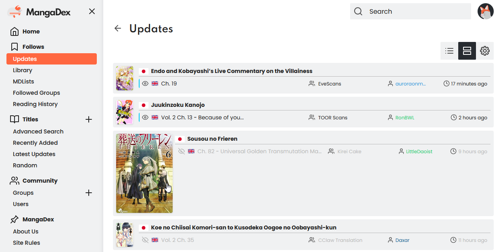

# MangaDex Condensed

Condense the new MangaDex website and remove whitespace.

Other features:

* Popup cover images.
* Different read chapter styles.
* Filled out anchor title tags for chapter names so you get the full name on mouse over.
* Extra room for chapter names.
* Removed some extraneous font bolding and reduced some text sizes.

MangaDex now has a default condensed mode, however this script still provides the above extra features.

