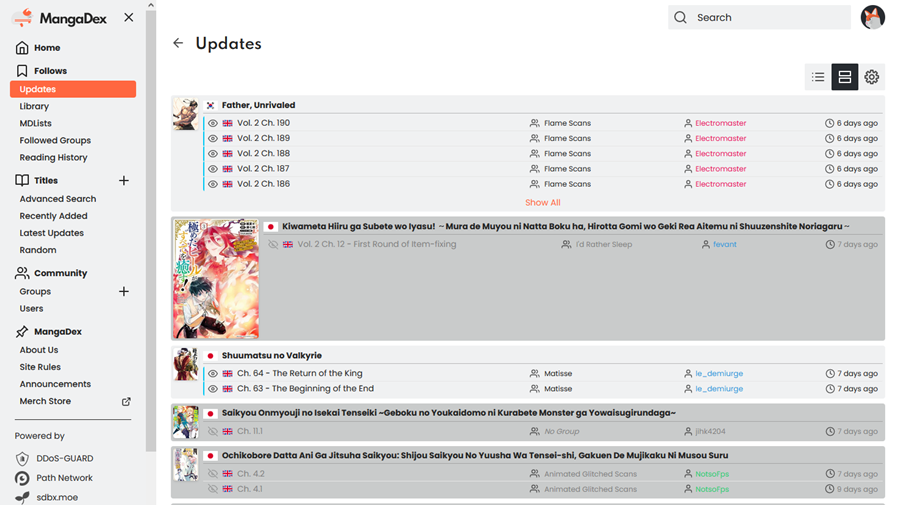

# MangaDex Condensed

Improves the MangaDex experience by giving you lots of display options.

## Features

* Optional condensed or hidden cover images that can expand to full size on mouse hover.
* Different styles on read chapters so you can easily see them.
* Filled out anchor title tags for chapter names so you get the full name on mouse over.
* Clicking and middle clicking on chapters visibly marks them as read without a refresh.
* Extra room for chapter names.
* Removed some extraneous font bolding and reduced some text sizes.

## Configurable Options
#### Popup/Enlarge Cover When Hovered On
Shows/enlarges the cover image when the mouse is hovered over:
- <small>**Container**: The whole manga container.</small>
- <small>**Title + Cover**: The manga title or cover image.</small>
- <small>**Title**: The manga title.</small>
- <small>**Cover**: The manga cover.</small>
- <small>**Never**: Never show/enlarge the cover image (MangaDex default).</small>  
Default: Cover

#### Preview Cover Style
Controls the size of the cover image.
- <small>**Small**: Small cover preview.</small>
- <small>**Full Size**: The full sized cover preview (MangaDex default).</small>
- <small>**Hidden**: Don't show the cover preview (cover can still be shown with popup options).</small>  
Default: Small

#### Read Chapter Style
Controls the style of read chapters in the chapter list.
- <small>**Darken Background**: Darkens the background color.</small>
- <small>**Lighten Text**: Lightens the text color.</small>
- <small>**Hide**: Hides the chapter / manga container.</small>  
Default: Darken Background

#### Left Click Opens In
Controls if chapters open in a new tab or not.
- <small>**Same Window**: Navigates to the chapter (MangaDex default).</small>
- <small>**New Window**: Opens chapter in a new tab.</small>  
Default: Same Window

