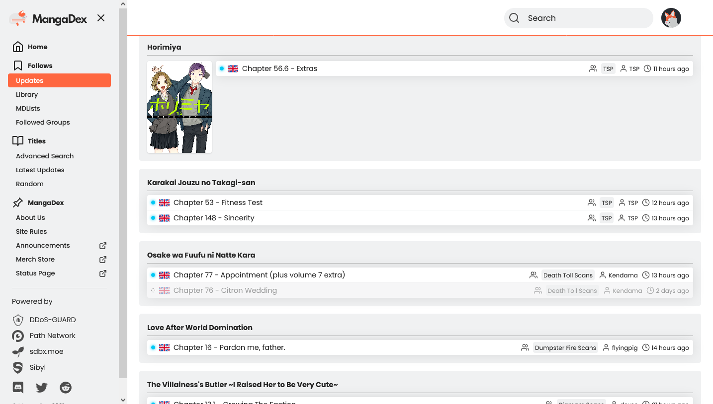

# MangaDex Condensed

Condense the new MangaDex website and remove whitespace.

Other features:

* Popup cover images when you mouse over the series title.
* Grayed out names of chapters you've read.
* Filled out anchor title tags for chapter names so you get the full name on mouse over.
* Extra room for chapter names.
* Removed some extraneous font bolding and reduced some text sizes.

MangaDex now has a default condensed mode that is almost identical to this script, however this script still provides the above extra features.

